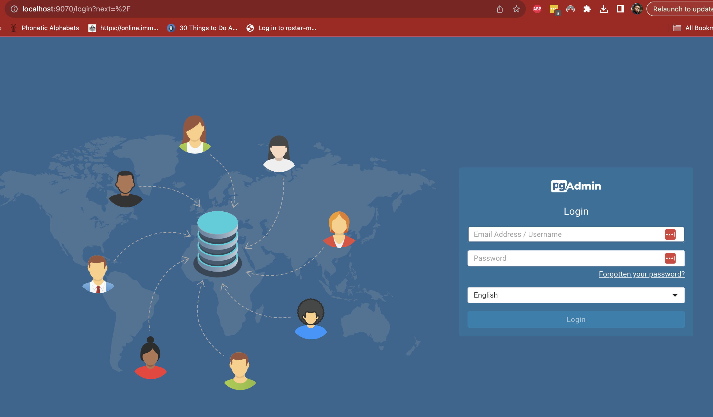
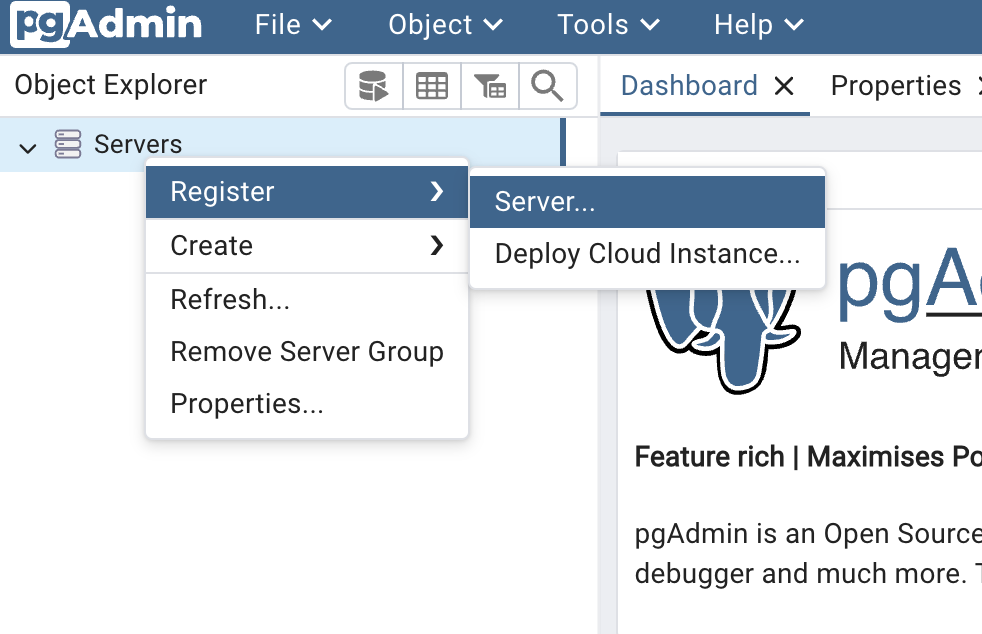
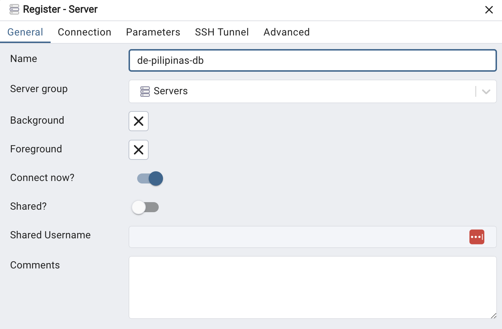
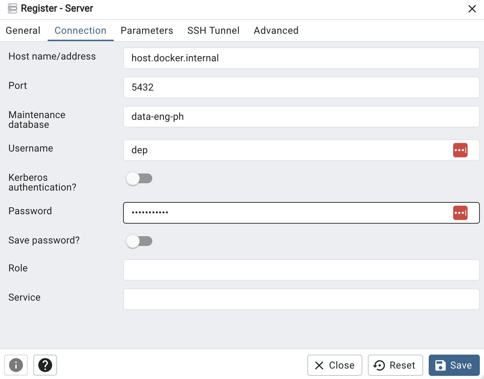

## Using postgres

To use postgres, you can use your existing DB clients like `DBeaver` or `pgadmin` as if the instance of the DB
server is running locally.

The connection string should be `postgresql://localhost:5432/data-eng-ph`.

### Accessing postgres shell

Normally you wouldn't want to access this as the infrastructure layer should rarely be changed, and in a containerized
environment, once the container starts, there should be no further changes to ensure `production` will not have
unintended side effects.

For the purpose of learning, the shell may be useful. However, instead of accessing the container, install the
`psql` executable for your OS as indicated in this 
[useful website](https://www.timescale.com/blog/how-to-install-psql-on-mac-ubuntu-debian-windows/).

You can then connect `psql` by providing the correct host, port and login credentials to it as you use it.

### Really desperate to use the shell inside the container

Ok, you really want to use that shell, then run the following command:

```shell
docker exec -it postgres-db /bin/sh
```

This is not really recommended, containerization is an out-of-the-box runtime. Any changes to the running container
while it is running will ensure `production` problems, practicing this as early as possible is very valuable.

## Using PGAdmin

Go to this link for [PGAdmin](http://localhost:9070).

It should show you the login page:



### Credentials

```text
User: de-pilipinas@mailinator.com
Password: dePilipinasUi
```

### Registering the connection

1. Right-click on Servers -> Register -> Server...

2. In the dialog, provide a name to the server

3. Go to the `Connection Tab`, the server details for our configuration are the following:
```text
Host: host.docker.internal
Database: data-eng-ph
User: dep
Password: dePilipinas
```

You can refer to the `docker-compose.yaml` file to find these settings as well.

